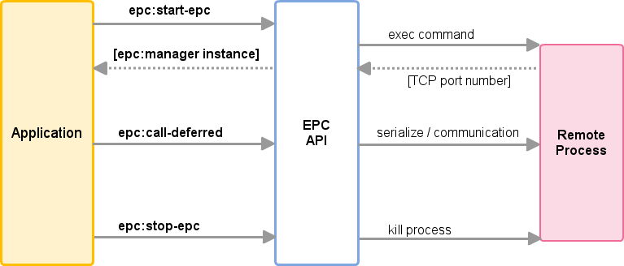

# Emacs RPC

This program is an asynchronous RPC stack for Emacs.  Using this
RPC stack, the Emacs can communicate with the peer process.
Because the protocol is S-expression encoding and consists of
asynchronous communications, the RPC response is fairly good.

Current implementations for the EPC are followings:
- epcs.el : Emacs Lisp implementation
- RPC::EPC::Service : Perl implementation
  - One can get this module by CPAN or PPM.
- python-epc : Python implementation
  - http://python-epc.readthedocs.org/en/latest/

The current status is beta. This library needs more applications to
confirm stability of the API and robustness of the implementation.

## Applications

Projects using EPC:

- [Emacs DBI](https://github.com/kiwanami/emacs-edbi):
  Database GUI and API for Emacs
- [Emacs Jedi](https://github.com/tkf/emacs-jedi):
  Python auto-completion for Emacs

## Sample Code

Here is a client code.

```lisp
(require 'epc)

(setq epc (epc:start-epc "perl" '("echo-server.pl")))

(deferred:$
  (epc:call-deferred epc 'echo '(10))
  (deferred:nextc it 
    (lambda (x) (message "Return : %S" x))))

(deferred:$
  (epc:call-deferred epc 'add '(10 40))
  (deferred:nextc it 
    (lambda (x) (message "Return : %S" x))))

;; calling synchronously
(message "%S" (epc:call-sync epc 'echo '(10 40)))

;; Request peer's methods
(message "%S" (epc:sync epc (epc:query-methods-deferred epc)))

(epc:stop-epc epc)
```

Here is a server code in perl.

```perl
#!/usr/bin/perl

use RPC::EPC::Service;

sub echo_test {
    my $methods = {
    
        'echo' => [sub {
            my $args = shift;
            return $args;
        },"args","just echo back arguments."],
        
        'add' => sub {
            my $args_ref = shift;
            my ($a,$b) = @$args_ref;
            return $a + $b;
        }
    };
    my $server = RPC::EPC::Service->new(0, $methods);
    $server->start;
}

echo_test();
```

Here is the equivalent server code in emacs lisp.

```lisp
(require 'epcs)

(let ((connect-function
       (lambda (mngr) 
         (epc:define-method mngr 'echo (lambda (&rest x) x) "args" "just echo back arguments.")
         (epc:define-method mngr 'add '+ "args" "add argument numbers.")
         )) server-process)

  (setq server-process (epcs:server-start connect-function))
  (sleep-for 10)
  (epcs:server-stop server-process))
```

The elisp server code should be started with some arguments (batch starting and indicating load pathes) like the following code:

```lisp
(setq epc (epc:start-epc "emacs" '("-L" ".." "-L" "~/.emacs.d/elisp" "-batch" "-l" "deferred" "-l" "concurrent" "-l" "epc" "-l" "epcs" "-l" "echo-server.el")))
```

# Installation

## Package installation

If you use package.el with Marmalade (http://marmalade-repo.org/), you just select the package 'epc' and install it.

## Manual installation

This program depends on following programs:

- deferred.el, concurrent.el / https://github.com/kiwanami/emacs-deferred
- ctable.el   / https://github.com/kiwanami/emacs-ctable

Place those programs and this one (epc.el) in your load path and add following code.

```lisp
(require 'epc)
```

# API Document

This section describes the overview of the EPC and how to use API.

### API Overview



### Object Serialization

All values which are transferred as arguments and a return value of the remote procedure calling, are encoded into the S-expression text format. 

Only primitive types can be transferred. The EPC stack can translate following types:

- nil
- symbol
- number
- string
- list
- alist
- complex object of list and alist.

The function `prin1` is employed for the serialization from objects to string.

The peer EPC stack decodes the S-expression text and reconstructs appropriate objects in the particular language environment.

### EPC Manager Object (epc:manager)

The struct `epc:manager` defines all information for an EPC activity, such as the connection status, remote methods and sessions. Many API functions needs the instance object as an argument. One, however, doesn't have to learn the internal slots and detailed implementations.

An instance of the struct `epc:manager` is created by calling the initialization function `epc:start-epc`. One can stop the EPC connection with calling the termination function `epc:stop-epc`.

### Start EPC (epc:start-epc)

* epc:start-epc (server-prog server-args)
  * Start the epc server program, establish the connection and return an `epc:manager` object.
  * Argument
    * server-prog: a path string for the server program
    * server-args: a list of command line arguments
  * Return
    * This function blocks the evaluation and returns an `epc:manager` object.
  * Error
    * If the server prints out non-numeric value in the first line or
      does not print out the port number in three seconds, it is
      regarded as start-up failure.

The established EPC session is registered to the global variable for the connection management interface. (See the Management Interface section.)

### Stop EPC (epc:stop-epc)

* epc:stop-epc (mngr)
  * Disconnect the connection and kill the server process.
  * If the `epc:manager` object has exit hooks, this function executes those clean-up hooks.
  * Argument
    * an `epc:manager` object

### Define Remote Method (epc:define-method)

* epc:define-method (mngr method-name task &optional arg-specs docstring)
  * Define a remote method
  * Argument
    * mngr: `epc:manager` object
    * method-name: the method name
    * task: function symbol or lambda
    * arg-specs: argument signature for the remote method [optional]
    * docstring: short description for the remote method [optional]
  * Return
    * an `epc:method` object

The documents are referred by the peer process for users to inspect the methods.

### Call Remote Method (epc:call-deferred, epc:call-sync)

* epc:call-deferred (mngr method-name args)
  * Call the remote method asynchronously.
  * Argument
    * mngr: `epc:manager` object
    * method-name: the method name to call
    * args: a list of the arguments
  * Return
    * Deferred object
    * See the next section for the error handling
* epc:call-sync (mngr method-name args)
  * Call the remote method synchronously.
  * Argument
    * mngr: `epc:manager` object
    * method-name: the method name to call
    * args: a list of the arguments
  * Return
    * a result from the remote method

### Error Handling

The remote method calling may raise the error. The error has two types, the peer's program (`application-error`) and the EPC stack (`epc-error`).

The `application-error` is a normal error which is caused by peer's program, such as 'division by zero', 'file not found' and so on. The programmers are responsible to this type errors, recovering error handling or just fixing bugs.

The `epc-error` is a communication error which is caused by EPC stack, such as 'connection closed', 'method not found', 'serialization error' and so on. This type errors are caused by environment problems, bugs of peer's program, our side one or the EPC stack.

Here is a sample robust code:

```lisp
(deferred:$
    (epc:call-deferred mngr "a-method" '(1 2))
    (deferred:next it
        (lambda (x)
            ;; Normal return
            ;; x: result value
            ))
    (deferred:error it
        (lambda (err)
         (cond
          ((stringp err)
            ;; application error
            ;; err: error message
           )
          ((eq 'epc-error (car err))
            ;; epc error
            ;; err: (cadr err) -> error information
           )))))
```

In the case of synchronous calling, a signal will be thrown immediately.

### Utilities

* epc:live-p (mngr)
  * If the EPC stack for `mngr` is eastablished, this function returns `t`.
* epc:query-methods-deferred (mngr)
  * Return a list of `epc:method` objects for the peer process.

### Define Server

Following functions require the 'epcs' package.

* epcs:server-start (connect-function &optional port)
  * Start EPC manager stack and initialize the manager with connect-function.
  * Argument
    * connect-function: a function symbol or lambda with one argument `mngr`, in which function the manager should define some remote methods.
    * port: TCP port number. (default: determined by the OS)
  * Return
    * process object

Here is a sample code for the EPC server:

```lisp
(require 'epcs)

(let ((connect-function
       (lambda (mngr) 
         (epc:define-method mngr 'echo (lambda (x) x) "args" "just echo back arguments.")
         (epc:define-method mngr 'add '+ "args" "add argument numbers.")
         )) server-process)

  (setq server-process (epcs:server-start connect-function))

  ;; do something or wait for clients

  (epcs:server-stop server-process))
```

* epcs:server-stop (process)
  * Stop EPC manager stack.
  * Argument
    * process: process object

### Debug

Because the EPC stack is designed to work asynchronously, sometimes one can not use the debugger for the own programs. Then, logging is useful to analyze the troubles.

The EPC has some debug functions for analyzing low level communication.

* epc:debug-out
  * If this variable is non-nil, the EPC stack records events and communications into the debug buffer.
* epc:debug-buffer
  * debug buffer name (default: '*epc log*')
* epc:log (&rest args)
  * logging debug messages

## Management Interface

TODO...

# Implementation

This section describes the EPC architecture and the wire-protocol so as to implement the peer stacks.

## Protocol Details

TODO...

## Other Stacks

- perl EPC document  http://search.cpan.org/~kiwanami/RPC-EPC-Service-v0.0.7/lib/RPC/EPC/Service.pm
- python EPC document  http://python-epc.readthedocs.org/en/latest/

# License

GPL v3

----
(C) 2012, 2013 SAKURAI Masashi. m.sakurai at kiwanami.net
